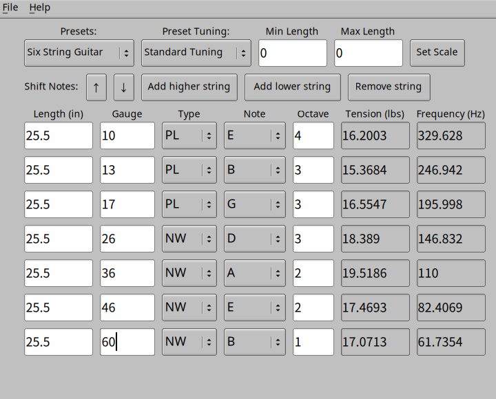

# string-tension
This app lets you calculate the tension of strings on a guitar or bass, and is fully modifiable to accomodate a variety of instruments or strings.

###Running the program
Run `./string-tension` to execute the program. You can modify any of the string parameters (length, gauge, type, note, and octave) to re-calculate tension. You can reset any modifications made, or switch to a bass preset by using the "Presets" choice widget.

You can also read more detailed usage of the program by pressing `Ctrl + H`, or viewing "Help" in the menu bar at the top of the window.

## Building from source
#### To create Linux binaries

To build this project, run `make` in the top-level directory. This will create an executable named "string-tension" in the "build" directory. You can run `make test` to create the test executable, which will also appear in the build directory.

#### To cross-compile Windows binaries

You will additionally need mingw64 with fltk compiled for mingw64. On Fedora Linux, these can be installed with the packages `mingw64-gcc-c++ mingw64-fltk-static`. To build this, run 'mingw64-make -f Makefile-mingw64`, which will create an executable named "string-tension.exe" in the "build" directory.

Detailed documentation can be generated by running `Doxygen` in the top-level directory.

## Build Requirements
- g++
- Fast Light Toolkit (FLTK)
- Googletest (Optional, only required for testing)
- Doxygen (Optional, used to generate HTML/LaTeX documentation)

## License
This program is available under the [MIT license](https://github.com/AaronAyub/string-tension/blob/main/LICENSE).